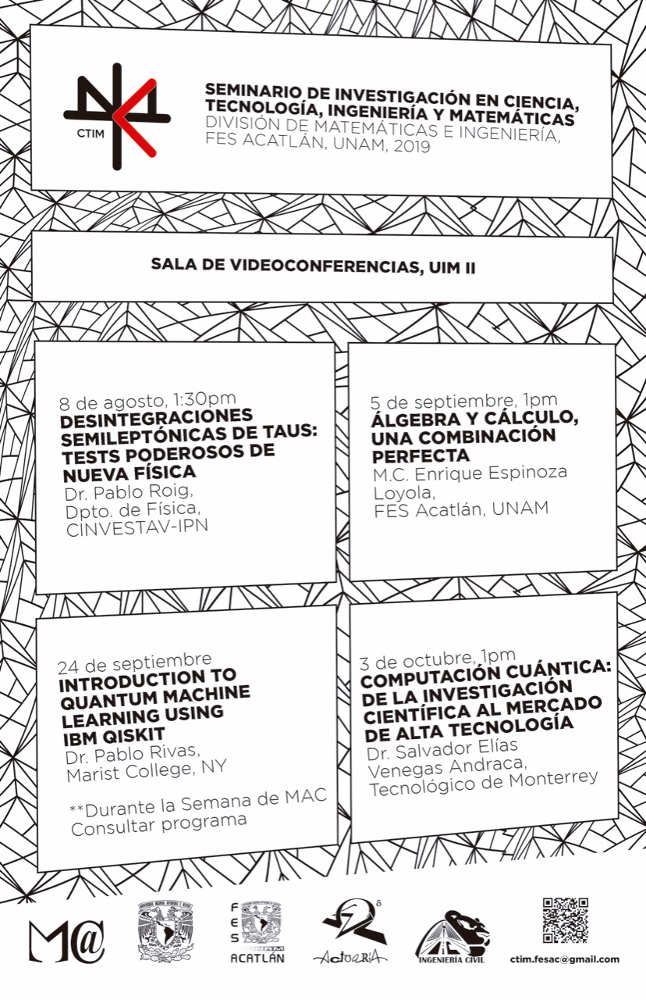

# Course: Programming I
*By: Javier A. Orduz-Ducuara*

This is a repository for the programming course 2019-I in FESAc. 

## Table of Contents

1. [Material](#material)
2. [Homework](#homework)
3. [About GPA](#aboutgpa)
4. [Activities](#activities)
5. [Referencias](#referencias)

## 1. Material  
Check the link ([:link:](http://sae.acatlan.unam.mx/)) use the data given for Salvador, Alfonso or Adriana to log in.
Besides you can download the document use in the class [here](https://www.dropbox.com/s/f5ats3j5liw0fqx/prgrmmng-I-clss.pdf?dl=0).

## 2. Lectures and homework 
The student has to read the following blogs:
- [7 secrets...](https://www.codementor.io/codementorteam/7-secrets-to-staying-motivated-when-learning-to-code-a2dy7hqar) 
- [To motivate myself...](https://www.quora.com/What-can-I-do-to-motivate-myself-for-programming-regularly-for-4-6-hours)

Now you can discuss with your classmates :stuck_out_tongue_winking_eye:.

Ask to Salvador, Alfonso, Miguel, Diana and GCCyC about the course, philosophy, ideas, projects or any.

Hi guys! In this part all of you will find the first homework. 

To start you have to read the next papers:
- Read the abstract and Introduction of this [paper](https://arxiv.org/pdf/1307.1719.pdf) (Identifying change patterns in software history)
- Read [The golden age of software architecture](https://ieeexplore.ieee.org/document/1605176/)
- Read the parts 1 and 2 of the [The History of Software Architecture - In the Eye of the Practitioner](https://arxiv.org/pdf/1806.04055.pdf)

Now you have to write a report (nice document!) about the importance and the impact of the software in the actual world. 
<!---
Print and bring the document next August 15th (wednesday) to discuss in the class. :+1: 
--->

## 3. About GPA 
Remember professor is not a :cop:, professor is a advisor who wants to discover differents things about 
programming.

   Object                                                         |  Porcentage  |
------------------------------------------------------------------| -------------|
  First exam (17-21 september):                 | 30 %         |
  Second exam (05-09 november):                 | 30 %         |
  Final Project (friday 16 november):                        | 20 %         | 
  Laboratory jobs and class exercises:                            | 10 %         |
  Material, informationn and homeworks or SAE (web site) exercise |10 %          |
  

## 4. Activities 

We extend the invitation to the seminar:

**Figure 1**: CTIM seminar 2019 I. 

<!--
\centering

\raggedright
\tableofcontents
\clearpage
-->

## 5. Referencias 
1. Ir a Mis algoritmos [:link:](http://www.mis-algoritmos.com/)

2. Ir a Resource [:link:](https://www.w3resource.com/c-programming/programming-in-c.php)

3. Ir a includehelp [:link:](https://www.includehelp.com/c/)

4. Ir a faceprep [:link:](https://www.faceprep.in/c-programming-questions/)

5. Ir a geekforgeeks [:link:](https://www.geeksforgeeks.org/c-programming-language/)

6. Ir a programiz [:link:](https://www.programiz.com/c-programming)

#### [Volver al inicio](#couproi)

